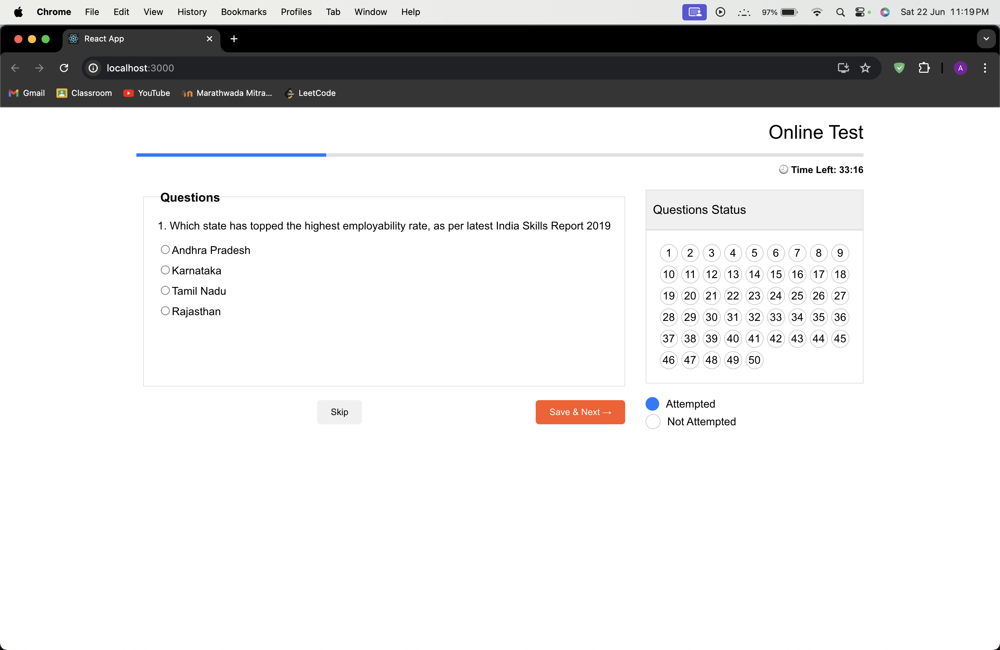

# Online Test Application

This is a responsive online test application built using React. The application includes a timer, question navigation, and status tracking for questions attempted.



## Getting Started

Follow these instructions to get a copy of the project up and running on your local machine.

### Prerequisites

Make sure you have the following installed:

- Node.js and npm: [Install Node.js](https://nodejs.org/)
- Git: [Install Git](https://git-scm.com/)

### Installation

1. **Clone the repository**:

    ```sh
    git clone https://github.com/your-username/your-repository.git
    ```

2. **Navigate to the project directory**:

    ```sh
    cd your-repository
    ```

3. **Install the dependencies**:

    ```sh
    npm install
    ```

## Running the Application

To start the development server, run:

```sh
npm start
